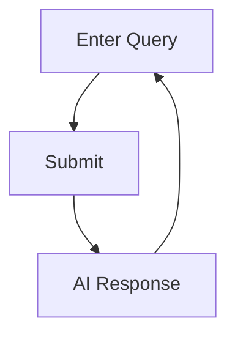

# RAG System PRD

Expectations
1. Time Estimate: ~2 hours for BE + ~30 mins for FE + ~30 mins for TDD + ~30 mins for test data drafting
   1. (Assuming that you've worked on most of the task below)
2. Tech Stack: doesn't matter
3. Functional UI/UX that demonstrates the whole flow
4. TDD + working code

## FE Flow Diagram



## Minimal FE Components

### Core Components
- **QueryInput**: Text area for user query
- **SubmitButton**: Trigger RAG process
- **ResponseDisplay**: Show AI response

### CTAs
- **"Ask"** - Primary submit action
- **"Clear"** - Reset input field

### Optional
- **FileList**: Show retrieved files (collapsible)
- **JsonToggle**: Switch response format

## Overview
Local text file retrieval system with OpenAI integration for contextual responses.

## Core Features

### 1. Vector Database Setup
- Ingest local text files into vector database
- Generate embeddings for text chunks
- Support text file updates

### 2. Similarity Search
- Input: single line of text
- Output: top 5 most relevant local text files
- Tech stack requirements
  - Explain what embedding algo you use

### 3. OpenAI Integration
- Input: System prompt + user prompt support
- Process: Context injection from retrieved files 
- Output: Response + 
- Models: GPT-4o

### 4. API Data Integration
- Fetch relevant internal data from provided endpoints
- Include API responses in OpenAI context
- Support multiple API calls per request

### 5. Structured JSON Response
- Force JSON output format
- Schema validation
- Consistent response structure

## Example Input/Output

### Input
```json
{
  "query": "How do I optimize database queries for better performance?",
  "system_prompt": "You are a senior software engineer. Provide practical advice.",
  "user_prompt": "Based on the provided documentation, give me specific optimization strategies.",
  "json_mode": true,
  "api_endpoints": ["https://api.company.com/db-metrics"]
}
```

### Vector Search Results
**Top 5 Retrieved Files:**
1. `docs/database-optimization.md` (similarity: 0.89)
2. `guides/sql-performance.md` (similarity: 0.85) 
3. `best-practices/indexing.md` (similarity: 0.82)
4. `troubleshooting/slow-queries.md` (similarity: 0.78)
5. `architecture/database-design.md` (similarity: 0.75)

### API Response (Optional)
```json
{
  "current_db_metrics": {
    "avg_query_time": "245ms",
    "slow_queries_count": 12,
    "index_usage": "67%"
  }
}
```

### OpenAI Context Construction
```
System: You are a senior software engineer. Provide practical advice.

User: Based on the provided documentation, give me specific optimization strategies.

Context:
[File: docs/database-optimization.md]
Use connection pooling to reduce overhead. Implement query caching for frequently accessed data...

[File: guides/sql-performance.md] 
Add indexes on frequently queried columns. Avoid SELECT * statements...

[API Data: DB Metrics]
Current average query time: 245ms, 12 slow queries detected...

[3 more files...]
```

### Output (JSON Mode)
```json
{
  "recommendations": [
    {
      "strategy": "Add composite indexes",
      "priority": "high",
      "expected_improvement": "30-50% query time reduction",
      "implementation": "CREATE INDEX idx_user_created ON users(user_id, created_at)"
    },
    {
      "strategy": "Implement query result caching", 
      "priority": "medium",
      "expected_improvement": "60% reduction for repeated queries",
      "implementation": "Use Redis with 15min TTL for user profile queries"
    }
  ],
  "current_issues": [
    "12 slow queries detected averaging 245ms",
    "Index usage at only 67%"
  ],
  "sources": [
    "docs/database-optimization.md",
    "guides/sql-performance.md"
  ]
}
```

### Output (Plain Text Mode)
```
Based on your documentation and current database metrics, here are specific optimization strategies:

**Immediate Actions:**
1. Add composite indexes on frequently queried columns - your current index usage is only 67%
2. Implement connection pooling to reduce the 245ms average query time

**Medium-term improvements:**
- Set up Redis caching for repeated user queries
- Analyze the 12 detected slow queries and optimize them

These strategies should reduce query times by 30-50% based on the patterns in your documentation.
```


